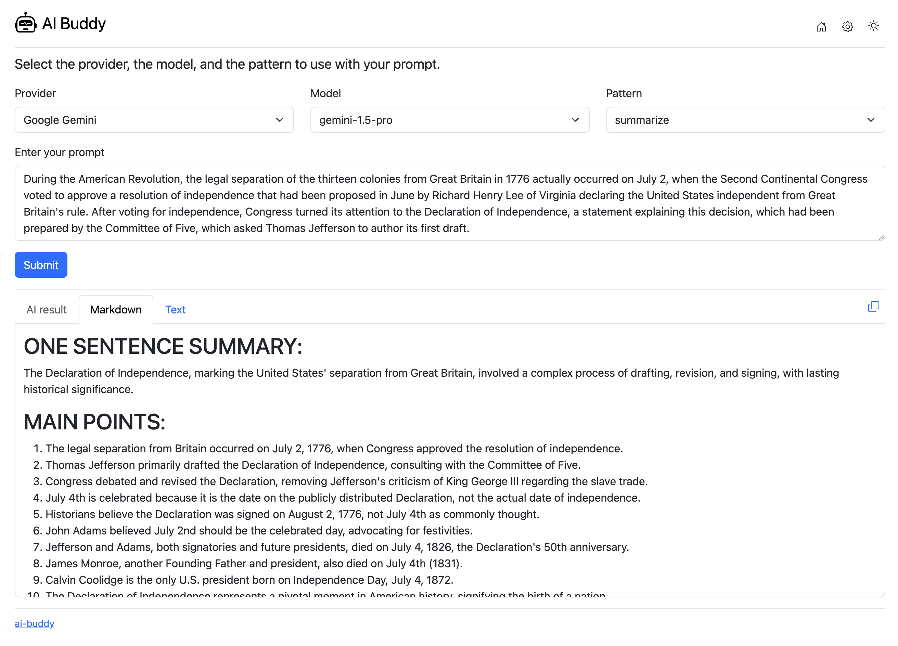

# ai-buddy

A terminal command in Go that is an AI tool to help solving problems using prompt engineering from a set of crowdsourced AI prompts.

It's heavily inspired by [Daniel Miessler](https://github.com/danielmiessler)'s tool [Fabric](https://github.com/danielmiessler/fabric). I created this as a simplified Go version, that's compiled, and probably a bit faster.

It currently supports Google Gemini API, OpenAI ChatGPT API, and local Ollama server.

## Demo


## Build and usage

You can download the source code and build and run the program:

```sh
$ go build
$ go install
$ ai-buddy
```

Or you can just download the latest release binary for your platform from the [Releases page](https://github.com/cetorres/ai-buddy/releases). The compressed release file contains the `compiled binary` for your platform, the `patterns` directory, and the `README.md` file.

## AI Models APIs

### Google Gemini API

For [Google Gemini](https://gemini.google.com/app) API it's using the following models:

- gemini-1.5-pro
- gemini-1.5-flash
- gemini-1.0-pro

You can obtain your own API key and enter it during the app set up:

```sh
$ ai-buddy --setup
```

Get your free API key at <https://aistudio.google.com/app/apikey>.

### OpenAI ChatGPT API

For [OpenAI ChatGPT](https://chat.openai.com/) API it's using the following models:

- gpt-3.5-turbo
- gpt-4
- gpt-4o
- gpt-4-turbo

You can obtain your own API key and enter it during the app set up:

```sh
$ ai-buddy --setup
```

Get your free API key at <https://platform.openai.com/api-keys>.

### Ollama

To use [Ollama](https://ollama.com), please download the Ollama app, install it and download an AI model. Follow the instructions on the website.

It runs locally on your machine and can use free and open source models like `llama3` or `gemma2`. A list of all available models can be accessed [here](https://ollama.com/library).

For more information about Ollama, please visit its [GitHub repository](https://github.com/ollama/ollama).

Once you followed all the steps to have Ollama properly installed, keep it running on your machine to be able to use it with `ai-buddy`.

You can set a custom Ollama URL via an environment variable:

```sh
$ export OLLAMA_HOST=<ollama_url>
```

## Patterns

Patterns are crowdsourced curated special prompts that improve the quality of the model's response for a given request.

Take a look at the [./patterns](./patterns/) folder and check how they are created and work.

The patterns directory is copied to the config directory after the first setup of the app (or running `ai-buddy --setup`).

The current list of patterns was copied from the [Fabric](https://github.com/danielmiessler/fabric) project.

## Web UI



- Start an HTTP server with the web UI of the app.
- You can use the web UI as an alternative to interact with the app.
- By default, it starts a local HTTP server on port 8080, but you can change the port.
- Set an environment variable: export AI_BUDDY_SERVER_PORT=`<port>`

## Output

```
ai-buddy 1.1.5 - Created by Carlos E. Torres (https://github.com/cetorres)
AI tool to help solving problems using prompt engineering from a set of crowdsourced AI prompts.

Example usage:
        echo "Text to summarize..." | ai-buddy -p summarize
        ai-buddy -p summarize "Text to summarize..."
        ai-buddy -p summarize -m gemini-1.5-pro "Text to summarize..."
        ai-buddy -p summarize -m gpt-3.5-turbo "Text to summarize..."
        cat MyEssayText.txt | ai-buddy -p analyze_claims
        pbpaste | ai-buddy -p summarize | pbcopy
        cat text.txt | ai-buddy -p summarize -m gemini-1.5-pro
        ai-buddy -p summarize -o -m llama3 "Text to summarize..."
        ai-buddy --webui

Commands:
        -s, --setup                            Set up the app with the necessary configuration.
        -p, --pattern <pattern_name> <prompt>  Specify a pattern and send prompt to model. Requires pattern name and prompt (also receive via pipe).
        -o, --ollama                           Use Ollama local server. You should specify the model name available on your local Ollama server.
        -m, --model <model_name>               Specify the model name to use.
        -l, --list                             List all available patterns.
        -v, --view <pattern_name>              View pattern prompt. Requires pattern name.
        -lm, --list-models                     List all available models.
        -w, --webui [--port <port_number>]     Start an HTTP server with the web UI of the app. Optional argument: --port <port_number>.
        -h, --help                             Show this help.

Google Gemini API:
        - To use this API, enter the key on the setup command.
        - Get your API key at https://aistudio.google.com/app/apikey

OpenAI ChatGPT API:
        - To use this API, enter the key on the setup command.
        - Get your API key at https://platform.openai.com/api-keys

Default model to use:
        - By default, the model "gemini-1.5-pro" from Google or "gpt-3.5-turbo" from OpenAI are used, depending on the API KEY entered.
        - You can set a custom default model on the setup command.

Ollama:
        - To use Ollama (https://ollama.com), please download the Ollama app, install it and download an AI model.
        - It runs locally on your machine and can use free and open source models like llama3 or gemma2.
        - A list of all available models can be accessed at https://ollama.com/library.
        - You can set a custom Ollama URL via an environment variable: export OLLAMA_HOST=<ollama_url>

Web UI:
        - You can use the web UI as an alternative to interact with the app.
        - By default, it starts a local HTTP server on port 8080, but you can change the port with --port <port_number>.
```

## More info

- Carlos E. Torres (<cetorres@cetorres.com>)
  - <https://cetorres.com>
  - <https://x.com/cetorres>

## Thanks

- [Daniel Miessler](https://github.com/danielmiessler) and all contributors from the [Fabric](https://github.com/danielmiessler/fabric) project for the great tool that inspired this one.
